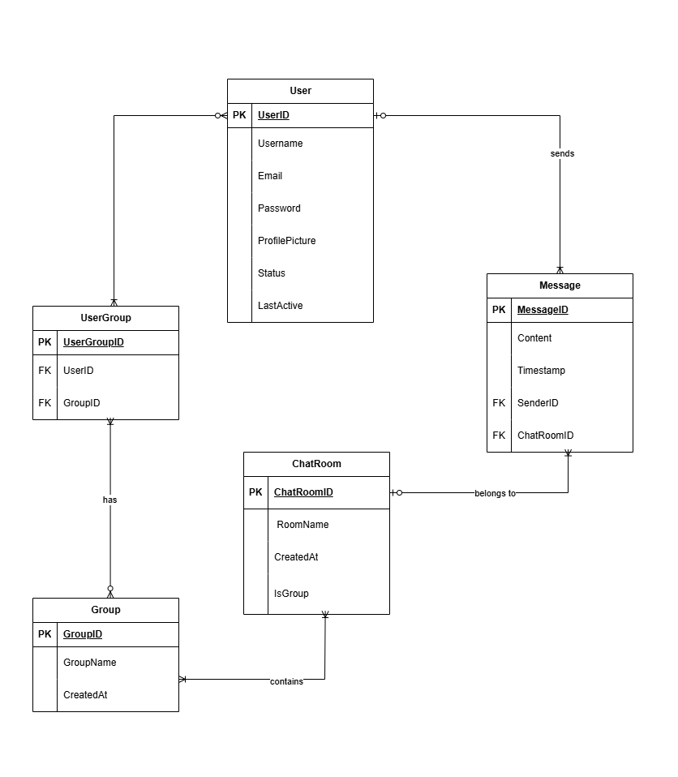

# Chat Application

A simple and responsive chat application built using the MERN stack (MongoDB, Express.js, React, Node.js). This application allows users to register, log in, and chat in real-time.

## Table of Contents

- [Features](#features)
- [Technologies Used](#technologies-used)
- [Demo](#demo)
- [Installation](#installation)
- [Usage](#usage)
- [API Endpoints](#api-endpoints)
- [Contributing](#contributing)
- [License](#license)

## Features


- User authentication (registration and login)
- Real-time messaging using Socket.io
- Responsive design for mobile and desktop
- User-friendly interface
- Chat history stored in MongoDB

## Technologies Used

- **Frontend**: React, Redux (if used), Axios, Socket.io-client
- **Backend**: Node.js, Express.js, Socket.io
- **Database**: MongoDB, Mongoose
- **Others**: JWT for authentication, bcrypt for password hashing

## Demo

[Live Demo](https://your-demo-link.com) (Replace with your actual demo link)

## Installation

### Prerequisites

- Node.js (>= 14.x)
- MongoDB (local or cloud instance)

### Clone the Repository

```bash
git clone https://github.com/yourusername/chat-app.git
cd chat-app
